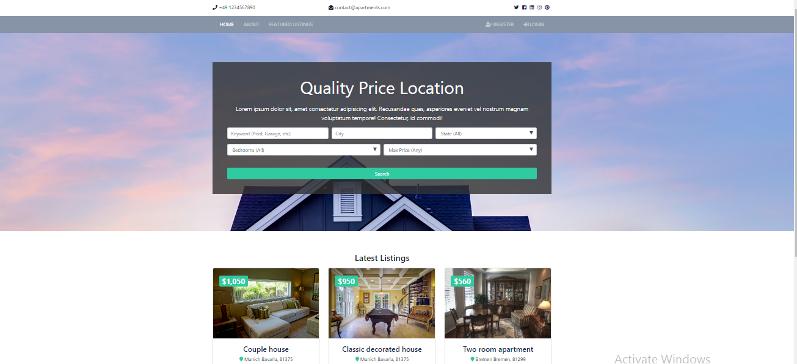
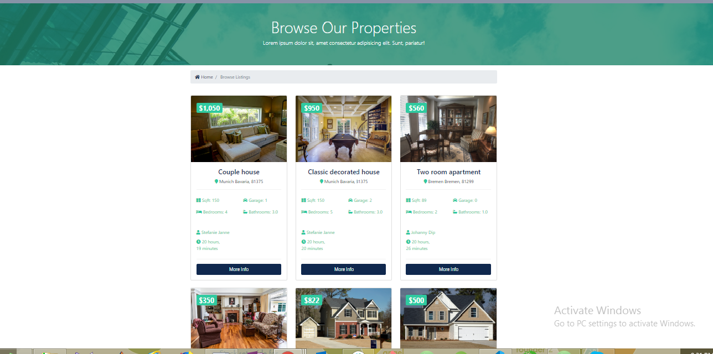
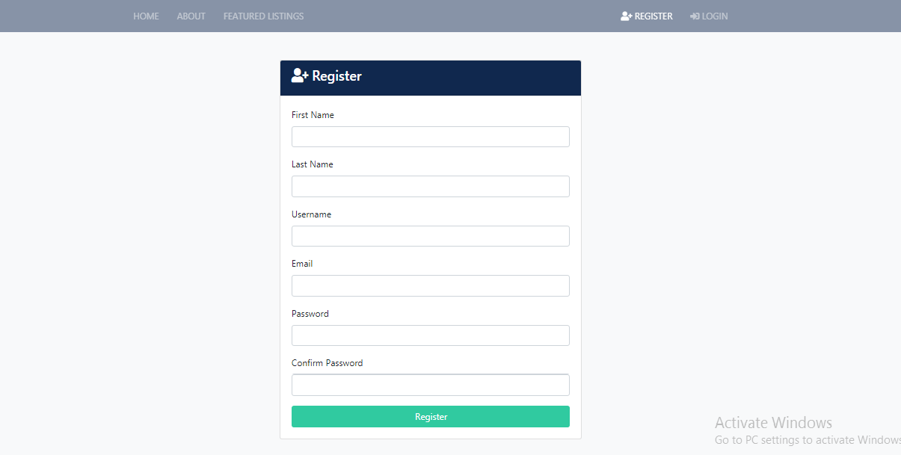
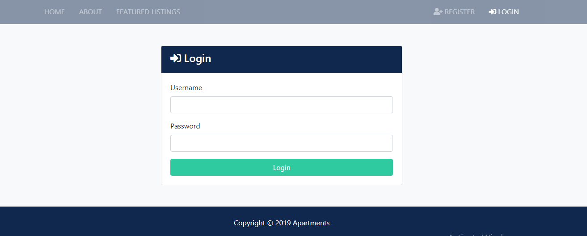
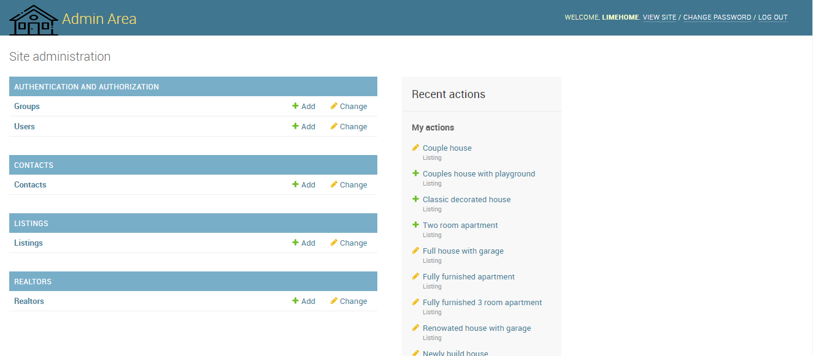
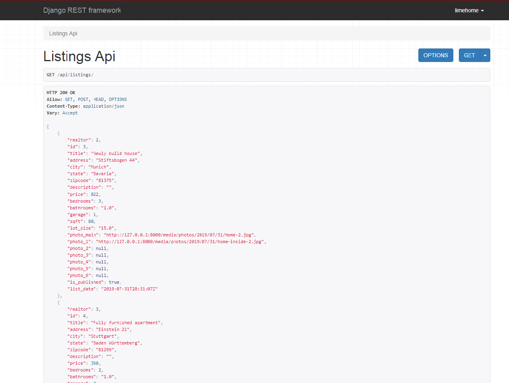
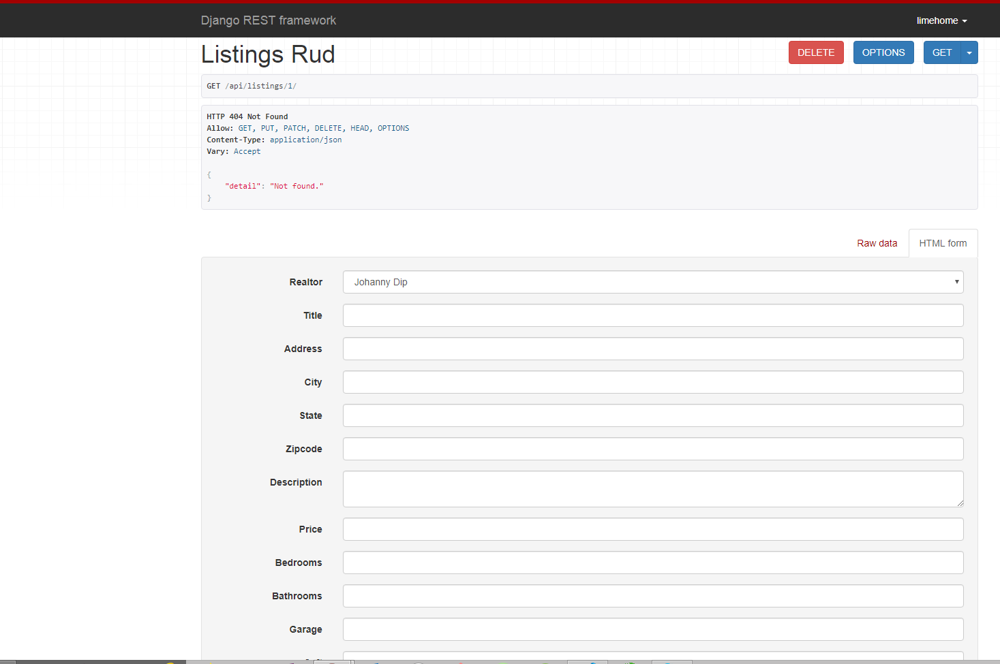

Sure, here's everything formatted in README.md format:

```markdown
# Full Stack Web Application For Presidio Hiring Challenge

## Introduction

This is a full-stack web application developed for the Presidio Hiring Challenge. It is built using Django and Django Rest Framework.

## Installation

To run this application, you need to have Python and Django installed on your system. You can install the required dependencies by running:

```bash
pip install -r requirements.txt
```

## Database Migration

After installing the dependencies, you need to migrate the database schema by running the following command:

```bash
python manage.py migrate
```

## Running the Server

Once the database migration is complete, you can start the development server by running:

```bash
python manage.py runserver
```

The application will be accessible at `http://localhost:8000/`.

## Web App Features

### Frontend Pages

- Home
- About
- Listings
- Single Listing
- Search
- Register
- Login
- Dashboard (Inquiries)

### Design Specification

- Use Any Logo (Frontend and admin)
- Branding colors - blue(#10284e) green(#30caa0)
- Mobile Friendly
- Social media icons & contact information

### Functionality Specification

- Manage listings, realtors, contact inquiries and website users via admin
- Role based users (staff and non-staff)
- Display listings in app with pagination
- Ability to set listings to unpublished
- Search listings by keyword, city, state, bedrooms and price (Homepage & search page)
- List realtors on about page with “seller of the month” (Control via admin)
- Listing page should have fields listed below
- Listing page should have 5 images with lightbox
- Lightbox should scroll through images
- Listing page should have a form to submit inquiry for that property listing
- Form info should go to database and notify realtor(s) with an email
- Frontend register/login to track inquiries
- Both unregistered and registered users can submit form. If registered, can only submit one per listing

### Listing Page Fields

- Title
- Address, city, state, zip
- Price
- Bedrooms
- Bathrooms
- Square Feet
- Lot Size
- Garage
- Listing Date
- Realtor – Name & Image
- Main image and 5 other images

## Screenshots

- HOME 

     

- LISTING     

     

- REGISTER     

    

- LOGIN   

      

- ADMIN  



- LISTING API



- LISTING RUD API



## Credits

Made by Ishita Saxena

```

This README provides clear instructions on how to install the dependencies, migrate the database, run the server, and describes the features and specifications of the web application.